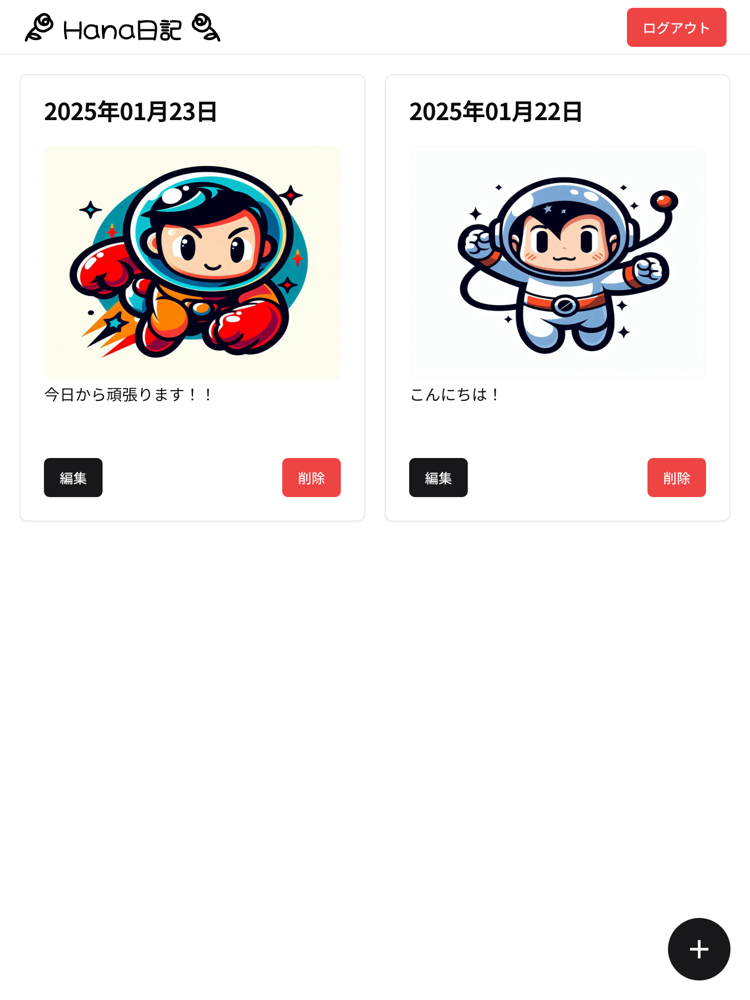

# 株式会社HanaPrime　スキルチェック実装

## 作ったもの

1行日記サイト：Hana日記



## 技術スタック

* Laravel 11
* Mysql 8
* Docker

## 実行方法

### Dev Containerを利用する

[VSCodeのDev Containers拡張機能](https://code.visualstudio.com/docs/devcontainers/containers)、 を利用し本サイトを実行できます。

(Dev Containerの起動まで、5〜10分かかります)

Dev Containerを起動すると、以下のコマンドを実行し環境構築を行います。

```bash
php artisan key:generate
php artisan migrate:fresh --seed
npm install && npm run dev
```

認証情報は以下になります。

> メールアドレス： test@example.com
>
> パスワード： password

### Laravel Sailを利用する

[Laravel Sail](https://laravel.com/docs/11.x/sail)を利用し本サイトを実行できます。

以下のコマンドを実行し環境構築を行います。(5〜10分程かかります。)

```bash
composer install
vendor/bin/sail up -d
vendor/bin/sail artisan key:generate
vendor/bin/sail artisan migrate:fresh --seed
npm install && npm run dev
```

認証情報は以下になります。

> メールアドレス： test@example.com
>
> パスワード： password

## 設計

ユーザーにつき、日記（Diary）を追加・編集・削除できます。

日記の追加・編集におき、次の制約を設けています。
* 日記内容
  * 必須項目
  * 255文字まで
* 日記日付
  * 必須項目
  * （本日を含めて）本日以前の日付しか登録できない（明日以降の日付を登録できない）
  * ユーザー単位でユニークである（同じ日付で日記を二つ登録できない）
* 画像
  * 任意項目
  * 画像しかアップロードできない（動画などはアップロード不可）
  * 1MB以上の画像はアップロード不可

日記の削除に関しては特に制約はありません。

ユーザーは、他のユーザーの日記を閲覧・編集・削除できません。
